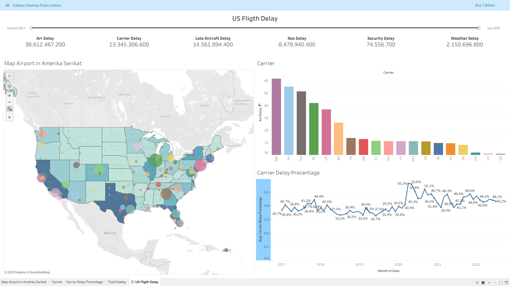

# ✈️ US Flight Delay Analysis (Tableau)

Analisis visualisasi data keterlambatan penerbangan di Amerika Serikat periode **2017–2022** menggunakan **Tableau** untuk mengidentifikasi penyebab utama keterlambatan, pola berdasarkan waktu, serta perbedaan keterlambatan antar maskapai dan lokasi bandara.

> Proyek ini berfokus pada **Data Visualization & Business Intelligence** menggunakan Tableau dan Microsoft Excel.

---

## 🖼️ Dashboard Preview



Dashboard ini menyajikan ringkasan keterlambatan penerbangan di Amerika Serikat dengan beberapa perspektif analisis, meliputi:

- Total Arrival Delay
- Carrier Delay
- Late Aircraft Delay
- NAS Delay
- Security Delay
- Weather Delay
- Distribusi keterlambatan berdasarkan maskapai
- Distribusi keterlambatan berdasarkan lokasi bandara
- Tren keterlambatan dari waktu ke waktu

---

## 🔎 Project Overview

Proyek ini menganalisis data keterlambatan penerbangan di Amerika Serikat dari tahun **2017 hingga 2022**.

Tujuan utama analisis adalah:

- Mengidentifikasi jenis keterlambatan yang paling dominan.
- Membandingkan keterlambatan antar maskapai.
- Melihat distribusi keterlambatan berdasarkan lokasi bandara.
- Menganalisis perubahan keterlambatan dari waktu ke waktu.
- Menyajikan hasil analisis dalam dashboard interaktif menggunakan Tableau.

---

## 📊 Dataset

Dataset yang digunakan merupakan **Airline Delay Cause Dataset** yang berisi informasi mengenai penyebab keterlambatan penerbangan.

| Informasi | Detail |
|---|---|
| Sumber | Kaggle |
| Periode | 2017–2022 |
| Data | Airline Delay Cause |
| Format data asli | CSV |
| Pengolahan data | Microsoft Excel |
| Visualisasi | Tableau Desktop |

### Sumber Dataset

[Kaggle — US Flight Delay from January 2017 to July 2022](https://www.kaggle.com/datasets/jawadkhattak/us-flight-delay-from-january-2017-july-2022)

---

## 🧹 Data Cleaning & Preparation

Data dipersiapkan sebelum digunakan dalam Tableau.

Tahapan yang dilakukan meliputi:

- Memeriksa struktur dan kualitas data.
- Membersihkan data yang tidak diperlukan.
- Menangani nilai yang tidak sesuai.
- Menyesuaikan format data agar dapat digunakan dalam analisis.
- Menyiapkan data untuk kebutuhan visualisasi di Tableau.

Proses data preparation dilakukan menggunakan **Microsoft Excel**.

Detail file dan proses cleaning tersedia pada folder:

`Cleansing data/`

---

## 📈 Data Analysis

Analisis dilakukan menggunakan beberapa perspektif utama.

### 1. Delay Cause Analysis

Menganalisis kontribusi beberapa penyebab keterlambatan:

- Arrival Delay
- Carrier Delay
- Late Aircraft Delay
- NAS Delay
- Security Delay
- Weather Delay

### 2. Airline Analysis

Membandingkan tingkat keterlambatan antar maskapai untuk melihat maskapai dengan kontribusi delay yang lebih tinggi.

### 3. Geographic Analysis

Visualisasi berbasis peta digunakan untuk melihat distribusi keterlambatan berdasarkan lokasi bandara di Amerika Serikat.

### 4. Time Series Analysis

Tren keterlambatan dianalisis berdasarkan periode waktu untuk melihat perubahan dan pola keterlambatan dari tahun ke tahun.

---

## 📊 Key Visualizations

### 🗺️ Airport Delay Distribution

Visualisasi peta digunakan untuk menunjukkan distribusi keterlambatan pada berbagai lokasi bandara di Amerika Serikat.

### 🏢 Airline Delay Comparison

Perbandingan jumlah keterlambatan antar maskapai digunakan untuk mengidentifikasi maskapai dengan kontribusi delay terbesar.

### 📅 Delay Trend

Analisis time series digunakan untuk melihat perubahan keterlambatan sepanjang periode 2017–2022.

---

## 💡 Key Insights

Berdasarkan dashboard dan eksplorasi data:

- **Arrival Delay** menjadi kategori keterlambatan dengan kontribusi terbesar dalam data.
- Keterlambatan memiliki perbedaan antar maskapai.
- Distribusi keterlambatan berbeda berdasarkan lokasi bandara.
- Pola keterlambatan mengalami perubahan sepanjang periode 2017–2022.
- Dashboard membantu menggabungkan perspektif **waktu, lokasi, maskapai, dan penyebab keterlambatan** dalam satu visualisasi.

---

## 🖥️ Dashboard

Dashboard dibuat menggunakan **Tableau Desktop** dengan menggabungkan beberapa visualisasi dalam satu tampilan interaktif.

File Tableau tersedia pada folder:

`Visualisasi Tableau/`

---

## 🛠️ Tools & Technologies

- **Tableau Desktop** — Data visualization & dashboard
- **Microsoft Excel** — Data cleaning & preparation
- **Kaggle** — Dataset source

---

## 📁 Project Structure

```text
us-flight-delay-analysis-tableau/
│
├── Cleansing data/
│   └── Data cleaning files
│
├── Data_Asli_Airline_Delay_Cause.csv
│
├── Images/
│   └── dashboard-overview.png
│
├── Visualisasi Tableau/
│   └── Tableau workbook
│
└── README.md
